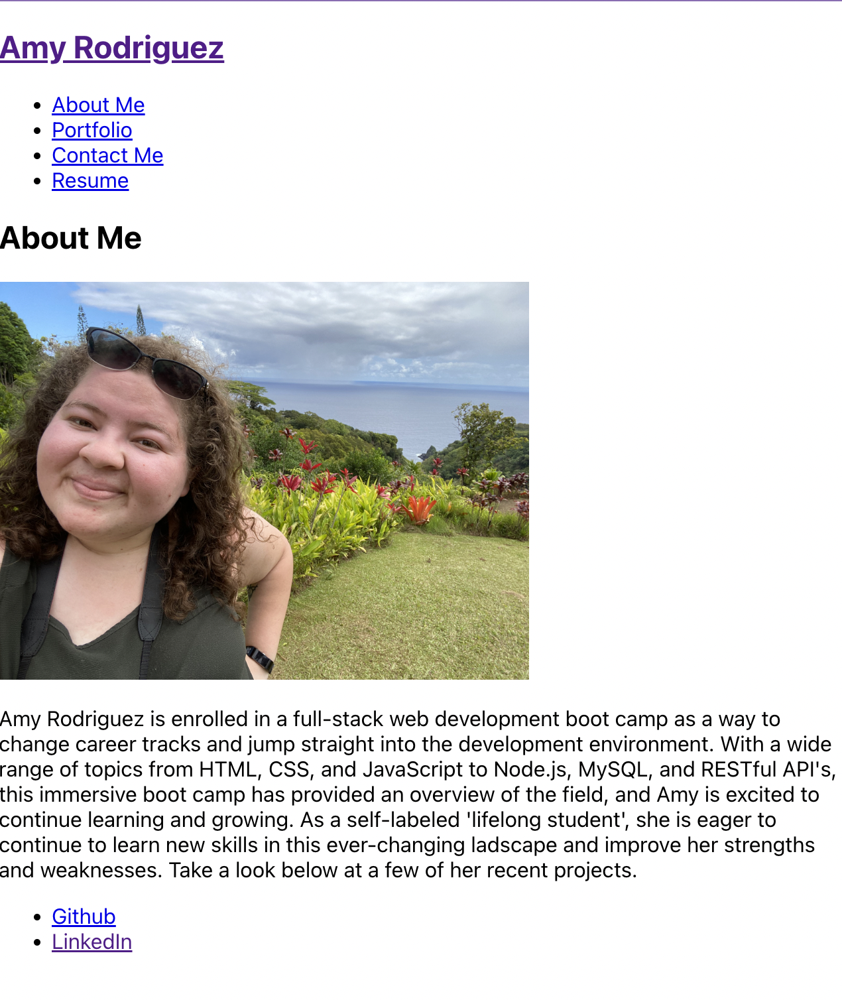

# Amy Rodriguz React Portfolio

  
  
    

## A portfolio created using React to showcase skills to future employers and collaborators.
-----
## Table of Contents
- [Installation](#installation)
- [Usage](#usage)
- [License](#license)
- [Challenges](#challenges)
- [Screenshot](#screenshot)
- [Questions](#questions)

## Installation
-----

## Usage
------
You can review my deployed portfolio at the link below.

## License
-------

  [MIT License](https://choosealicense.com/licenses/mit/)
    

    A short and simple permissive license with conditions only requiring preservation of copyright and license notices.
    

## Challenges
------
The challenges I had through this project was the conditional rendering of the navigation components. For future development, I would like to optimize the way the compontents are rendered. I do also want to re-organize the way the projects are created and displayed.

## Screenshot
-----

[Portfolio](https://queenamyrodriguez.github.io/AmyR-react-portfolio/)

## Questions
-----
You can find me on [Github](https://github.com/queenamyrodriguez) or through the email queenamyrodriguez@gmail.com

